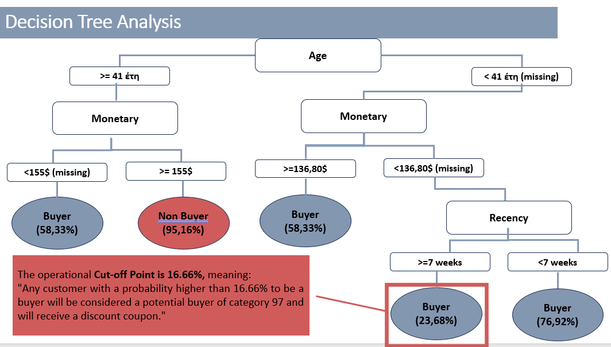

# Decision Tree Analysis Insights

## Objective:

Conduct analysis on historical data, to create a model predicting current data using SAS Viya. The prediction concerns whether a customer will be a buyer in category 97 or not. Once this predictive model is built, targeted coupon campaigns can be sent to customers more likely to respond positively to category 97, thereby avoiding ad expenses on those less likely to respond.
  
## Process Overview:

### Check the proportion of buyers to non-buyers. Ideally, aiming for over 10%. If not, consider undersampling or oversampling.

Using a pie chart revealed that I have 30.2% buyers (631 buyers) and 69.8% non-buyers (2280 non-buyers) out of a total of 2,093 customers. This indicates that my data doesn't require undersampling or oversampling techniques.
    
### Check for null values. 

There are no null values
    
### Establish an operational cut-off point based on a profit matrix.

The profit matrix forms the basis for determining the minimum probability (minimum propability) a customer should be classified as a buyer before creating the decision tree (prediction model). This minimum probability, termed the operational cutoff point, is crucial to ensure profitable marketing campaigns.

- **Operational Cutoff Point Calculation:**
  - Consider P(Buyer) as the probability a customer is a buyer.
  - Calculate Total Expected Profit = Expected_Profit_PredictionGood – Expected_Profit_PredictionBad.
  - Define P(Buyer) > = 0.1666 as the cutoff point (minimum probability).
  
- **Interpretation of Cutoff Point:**
  - A value of 0.1666 represents the minimum probability a customer needs to be classified as a potential buyer in category 97, ensuring overall profit rather than loss.
  
- **Key Insight:**
  - The theoretical cutoff point (50%) is less efficient than the calculated 16.66%. Choosing the theoretical 50% loses potential buyers (P(Buyer) range: [0.166, 0.5]), impacting the expected profit positively.

### Construct a Decision Tree and extract conclusions.

### Decision Tree Explanation

Operational interpretation of the decision tree model results:

| Terminal Leaf | Explanation |
| --- | --- |
| Terminal Leaf 1 | If the customer's age is 41 or older and their total monetary value in the business is greater than or equal to $155, there is a 58.33% probability of purchasing category 97. |
| Terminal Leaf 2 | If the customer's age is 41 or older and their total monetary value in the business is less than $155 (missing information), there is a 95.16% probability that this customer will not purchase category 97. |
| Terminal Leaf 3 | If the customer's age is younger than 41 (or missing) and their total monetary value in the business is greater than $136.80, there is a 92.77% probability that this customer will purchase category 97. |
| Terminal Leaf 4 | If the customer's age is younger than 41 (or missing), their total monetary value in the business is less than $136.80 (or missing), and their most recent purchase was at least 7 weeks ago (inclusive), there is a 76.32% probability that this customer will not purchase category 97. |
| Terminal Leaf 5 | If the customer's age is younger than 41 (or missing), their total monetary value in the business is less than $136.80 (or missing), and their most recent purchase was less than 7 weeks ago (excluding 7), there is a 76.92% probability that this customer will purchase category 97. |

Additional Note: Considering the operational cut-off point (0.166), the model categorizes customers with a probability greater than 16.66% as buyers (or conversely, those with a probability less than 83.34% as non-buyers). Terminal Leafs 1, 3, 4, 5 classify customers as buyers, while Terminal Leaf 2 categorizes them as non-buyers.

The significant variables distinguishing between categories are age, total monetary value, and recency. These factors help comprehend a customer's behavior concerning the purchase of category 97. Age reflects consumer preferences, indicating potential attraction towards category 97 for a younger audience. Total monetary value reflects economic capacity, while recency mirrors customer dedication to the business. Leveraging this information, strategies can be adapted to target customers meeting specific criteria, increasing profits from potential purchases, while mitigating losses from wrongly targeted customers.

## Analysis of Model Performance Metrics

**Cumulative Respose Graph**

The Response Rate is determined by arranging all customers from the validation set based on their probabilities of being buyers, establishing the response rate via the formula: Response_rate = TP / Total Number of Predicted Positives = TP / (TP + FP). The cumulative response rate is displayed on the y-axis, while the x-axis signifies the percentages of top customers sorted by their buyer probabilities according to the model.

In consideration of the analysis:

- For the 15%:
Selecting the top 15% of customers (sorted and more likely to be buyers according to the optimal decision tree model), 87.879% of these customers will be buyers (purchasing category 97).

**Response Graph**

Building on the preceding analysis of the % cumulative response graph, we can proceed to analyze the % response graph. These details still pertain to the validation set. The data is again sorted in descending order of probability (to be a buyer=1). However, I am not operating cumulatively here; instead, I segment the sorted clients into buckets with a 5% buyer rate (20 quantiles/buckets in total) in each (x-axis).

Taking all this into account, I interpret the result as follows:

For the 15%:

In the optimal decision tree, the response rate is 87.879%.
If I take the 4th bucket (15%-20%) of the top clients (sorted with a higher probability of being buyers according to the optimal decision tree model), 87.879% of clients in this bucket will be buyers (purchasing category 97).

**Cumulative Lift Chart**

The % cumulative lift chart is generated by dividing the values derived from the cumulative response chart by the percentage of the naive model (if, for instance, no model were used for prediction). The x-axis is divided into 20 quantiles of 5% of the data (in descending order of probability).

From the above, we observe:

- If the cumulative lift value is greater than 1, it's better to use our model for prediction than no model (random selection).
- The cumulative lift measures how much more likely it is to observe P(Buyer)=1 in a specific percentage (quantile) using our model compared to random selection.

Considering all the above, I interpret the result as follows:

For the 20%:

In the optimal decision tree, the cumulative lift = 2.9758%.
If I take the top 15% of clients (sorted with a higher probability of being buyers according to the optimal decision tree model), there will be 2.9758 times more buyers found among these clients than if I followed the same process without a model (naïve model-random).

**Cumulative % Captured Response Graph**

The cumulative % captured response graph pertains to the validation set. The data is still sorted in descending order of probability (to be a buyer=1) and is cumulative. Essentially, the graph presents the percentage of sorted claims in the validation set (x-axis), representing the percentage of clients the model correctly identifies as buyers compared to the total clients identified as buyers in the validation set (always referring to the respective cumulative percentage). More specifically, considering all the above, I can express the cumulative % captured response rate as follows:

For the 25%:

In the optimal decision tree, the cumulative % captured response rate = 59.516%.
If I take the top 20% of clients (sorted with a higher probability of being buyers according to the optimal decision tree model), 59.516% of the clients identified as buyers will be found among the entire validation dataset.

**Apply the Scoring and Model Evaluation**

Uploading the newcustomers table and running a profiling through the manage data feature yielded the following results:

I noticed there are no null values, so I proceeded to create the node score_Data. Utilizing the results obtained, I used the explore and visualize tool, resulting in the following bar chart:

The model predicted that out of 200 clients (pertaining to the new customers file), 155 will be buyers (78% buyers). Conversely, 45 will be Non-Buyers (22% Non-Buyers). Observing the dataset, the minimum probability found is 4.83%, and the maximum is 92.77%. However, these values refer to the entire dataset (buyers & non-buyers).
