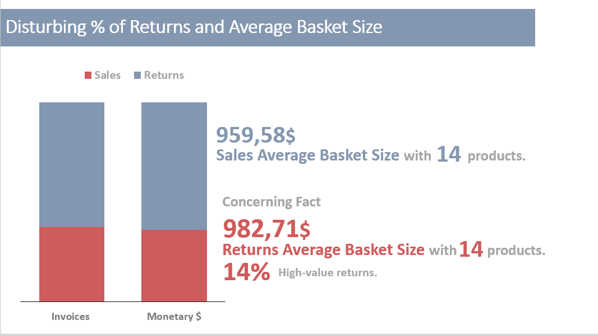

# Analyzing Real-World POS Data: Unveiling Consumer Behavior & Strategic Insights using SAS Software

The present work entails a comprehensive analysis of real sales data from XYZ Company, specializing in retail products related to hobbies like camping, golf, and more. This analysis employs exploratory methods alongside machine learning techniques, including RFM analysis (clustering), market basket analysis, and prediction using decision trees. Leveraging the capabilities of SAS Viya & SAS EG tools, this study extracts valuable insights from the data, uncovering patterns and trends critical for informed strategic decision-making.


[**Exploratory Analysis**](https://github.com/moraitis-alexandros/Analyzing-Real-World-POS-Data-Unveiling-Consumer-Behavior-and-Strategic-Insights-using-SAS-Software/blob/main/Exploratory-Analysis)

The Exploratory Data Analysis (EDA) encompassed a comprehensive investigation into sales dynamics, including detailed insights into sales levels across diverse product types. It delved into returns, calculating total monetary value and introducing the novel Loss Rate metric, shedding light on product inefficiencies impacting revenue. Analysis identified top-performing products per type, examined market share, mapped regional revenue distribution, and assessed supplier demand. Additionally, it explored variations in average basket size across weekdays, providing key insights into consumer behavior. The creation of new metrics like the Loss Rate enriched the analytical framework, empowering strategic decision-making for revenue optimization and operational enhancements at XYZ company.

[**RFM Analysis**](https://github.com/moraitis-alexandros/Analyzing-Real-World-POS-Data-Unveiling-Consumer-Behavior-and-Strategic-Insights-using-SAS-Software/blob/main/RFM-Analysis)

The enriched RFM analysis, segmented customers into four categories - Best (48.6%), First Timer (17.6%), Churner (28%), and Hibernating (19.7%). This segmentation, coupled with age-based clusters and new metrics like Weighted Churn Rate and Weighted Best Rate, pinpointed regions with high churners and concentrations of best customers. These insights paved the way for targeted strategies, emphasizing increasing the share of Best customers while addressing the challenge of high churn rates. Exploring potential correlations between churners and returns also provided actionable insights for product/service enhancements, contributing to XYZ company's refined targeting, retention, and satisfaction initiatives.

[**Market Basket Analysis**](https://github.com/moraitis-alexandros/Analyzing-Real-World-POS-Data-Unveiling-Consumer-Behavior-and-Strategic-Insights-using-SAS-Software/blob/main/Market-Basket-Analysis)

Identified pivotal products influencing sales, such as Hailstorm Steel Woods Set, Course Pro Umbrella, and Husky Rope 60, which collectively contributed to a substantial portion of total sales.

[**Decision Tree Analysis**](https://github.com/moraitis-alexandros/Analyzing-Real-World-POS-Data-Unveiling-Consumer-Behavior-and-Strategic-Insights-using-SAS-Software/blob/main/Decision-Tree-Analysis)

Predicted customer category 97 purchases to strategically allocate discount coupons, significantly enhancing buyer predictions by 2,9758 times compared to a basic model.

*The project was part of my final SAS Joint Certificate Report*

## References


## Exploratory Data Analysis Insights:

## Objective: 

The primary aim was to conduct an in-depth exploratory data analysis (EDA) to to uncover supplier demand, revenue trends, and factors driving consumer preferences. It encompassed customer demographics, regional insights, sales and return patterns, top products, promotional effectiveness, supplier analysis, and regional loss rates. Additionally, it delved into product origin preferences across different countries. Operational suggestions were proposed to optimize returns management, refine promotion strategies, enhance supplier relations, address regional challenges, and diversify product appeal.

## Tools Used

SAS EG

SAS Viya

## Dataset Overview:

- *Invoice*: 20,692 unique transactions (baskets)

- *Basket*: 312,537 entries connecting transactions (baskets) with products

- *Customers*: 8,584 unique customers

- *Products*: 144 unique items

Sales and returns are adjusted:

  - *Sales*: $17,458
    
  - *Returns*: $3,234
    
  - *Total*: 20,692 entries post-cleaning.

## Feature Engineering

*Data Cleaning:* In the process of data cleaning and age filtering, customer ages were calculated and subsequently filtered to ensure logical values. The data cleaning phase involved removing entries with birth years earlier than 1910 (considered overage) or later than 2001 (considered underage), contributing to a refined dataset.

*Generate Age Attribute:* Conversion of the birth date to a date format, the creation of a new variable counting the days passed since that date, and the calculation of age using functions, the birth date column is then removed to derive the rounded age. The code also takes into account leap years


*Age Range Transformation:* To enhance the analysis of age, it would be beneficial to categorize ages into specific age brackets (Very Young, Young, Middle Age, Mature, Old, Very Old). With this categorization, 
a more organized result emerges: Middle age customers represent 37.09%, followed by the Young group at 30.21%, while the Very Young group comprises 18.20%, showing a clearer breakdown of age segments.

*Top Product per Product Type & Market Share:* Developed a code snippet in SAS EG in order to examine top-selling products in each category, highlighting significant items, each occupying important share of their respective category's sales. Also highlight products that stand out with substantial market shares. Notably, while certain top products within some categories hold smaller shares, but collectively contribute significantly to overall sales, showcasing diversity despite individual product dominance. This analysis sheds light on both specific product performance and broader category trends in the market.

```sql
 %_eg_conditional_dropds(MILESTON.QUERY_TOP_prod_CATEG_PROD2);

PROC SQL;
   CREATE TABLE MILESTON.QUERY_TOP_PROD_CATEG AS 
   SELECT DISTINCT t1.'Product type'n,
   t1.SUM_of_COUNT_of_InvoiceNo as Category_Sales, 
PUT((t1.SUM_of_COUNT_of_InvoiceNo/300146),percent10.) as Category_Share,
t2.Product AS Top_Category_Product, 
   t1.MAX_of_COUNT_of_InvoiceNo as Product_Sales,
  PUT((t1.MAX_of_COUNT_of_InvoiceNo/t1.SUM_of_COUNT_of_InvoiceNo),percent10.) as Product_Category_Share 
      FROM    (SELECT t1.'Product type'n, 
          /* MAX_of_COUNT_of_InvoiceNo */
            (MAX(t1.Total_Invoices_include_Product)) AS MAX_of_COUNT_of_InvoiceNo, 
          /* SUM_of_COUNT_of_InvoiceNo */
            (SUM(t1.Total_Invoices_include_Product)) AS SUM_of_COUNT_of_InvoiceNo
      FROM MILESTON.QUERY_FOR_TOP_PRODUCTS_PER_TYPE t1
      GROUP BY t1.'Product type'n) as t1
           INNER JOIN MILESTON.QUERY_FOR_TOP_PRODUCTS_PER_TYPE t2 ON (t1.MAX_of_COUNT_of_InvoiceNo = 
          t2.Total_Invoices_include_Product AND t1.'Product type'n = t2.'Product type'n)
order by Product_Sales DESC;
QUIT;
```

*Maps Creation and integration with other Datasets:* Analyzed loss rates by connecting demographic density, observed significant loss rates in specific areas, and created vizualizations to depict these relationships.
Generated maps in Viya using longitude and latitude data, establishing a Geo-Hierarchy based on Country and Region levels for spatial analysis.

## In-depth Insights:

#### Sales & Returns Patterns:



📍 Total sales amount to $17,458 with returns standing at $3,234. Returns represent approximately 15.63% of overall transactions compared to 84.37% in sales.

📍 The monetary value of sales reaches $16,752,418.20, while returns sum up to $3,178,087.90, constituting about 15.95% of total transactions.

📍 Both return rates, in terms of quantity and monetary value, are concerning, urging further investigation into the reasons behind this trend.

📍 Average basket sizes for both sales and returns are close, indicating larger basket values for returns, potentially linked to delayed deliveries and high-value product returns. Investigating delivery delays' impact on high-value returns is crucial.

📍 Efforts should aim to increase sales basket metrics while simultaneously reducing return-related figures.

#### The Top Products & Categories Shares


📍 The analysis aims to identify top-selling products in various categories and their market shares.

📍 Significant products, such as Hailstorm Steel Woods Set, Course Pro Umbrella, and Hailstorm Steer Irons, each occupy around a quarter (25% - 26%) of sales in their respective categories.

📍 The Husky Rope 60 and Blue Steel Max Putter stand out, dominating their category with a substantial 34% market share.

📍 Notably, in categories like watches and eyewear, while top products hold smaller shares (8% and 6% respectively), these categories collectively contribute significantly to total sales (9% and 11% respectively).

📍 This analysis provides insights into both specific product performance and broader category trends within the market.

#### Promotion Analysis:


📍 Consumers tend to purchase products even when they aren't on sale, a trend worth consideration since, during the dataset's analysis period (as outlined in the appendix), all products were sold at some point on offer.

📍 Promotional efforts might not be targeting the right audience at the right time. That scenario indicates a problem with promotional campaigns not reaching the intended audience, resulting in wasted advertising expenses.

📍 Further customer analysis (using cluster & association rules) is crucial in both cases to ensure the right products are marketed to the right people at the appropriate times.

#### Supplier Analysis:


📍 Dragon SA leads in sales with 47,853 units, followed by Toktai & Chen at 43,543 units. However Toktai & Chen products are included in more invoices. This fact makes him the supplier with the highest demand.

📍 Carper n Sons, with an average of 13 unique codes, sells fewer products than Fabulo Ltd with 11 codes. This indicates lower consumer preference for Carper n Sons' products, prompting a need for quality checks and potential packaging improvements.

📍 Carper n Sons' products show lower demand despite higher value, necessitating further investigations into functionality, packaging, and price-quality relationships.

📍 Implementing electronic reviews to customers who purchased or returned Carper n Sons' products could offer deeper insights, especially if targeted towards better customer segments identified through RFM analysis for improved feedback and understanding of low demand reasons (price, product quality, or packaging).

#### Density Analysis:


📍 Regions AM and PI are quite sparsely populated, with Loss Rates of 32% and 28%, respectively, indicating that a significant portion of the income from these areas might not be actual income due to product returns.

📍 These areas' location, their sparse population, and potential delays in product delivery due to infrequent transportation could contribute to customer dissatisfaction and product returns.

📍 Additionally, densely populated regions like DF and SP also exhibit a high Loss Rate, possibly due to shipping delays caused by shipment volumes, resulting in returned products and additional expenses for the business if customers haven't received their orders.

📍 The company should focus on these regions to investigate issues further, such as collecting data on delivery times. Sending electronic surveys or contacting customers could help understand customer satisfaction levels and pinpoint problems related to product satisfaction, delivery times, or non-received items. The overall goal should be to reduce the Loss Rate in these regions.


#### Product Origin Analysis:


📍 Turkish Product Revenue: Lower total revenues indicate potential consumer disinterest or lower pricing. Unlike Chinese products, Turkish items lack consumer preference despite similar pricing.

📍 Indian Product Lead: Despite lower individual values compared to similar US-made items, Indian products attract consumers due to a better quantity-price balance, securing the top position in revenue.

📍 US Product Appeal: Despite higher unit values compared to counterparts, US products rank second in revenue, favored for their quality-price equilibrium.


### Operational Suggestions:

**Optimize Returns Management:** Develop strategies to reduce return rates by analyzing reasons behind returns, especially focusing on investigating delayed deliveries and high-value product returns to improve customer satisfaction.

**Refine Product Promotion Strategies:** Tailor promotional campaigns to target specific audiences effectively, ensuring that marketing efforts reach the right people at the right time, possibly through advanced customer segmentation techniques.

**Enhance Supplier Relations:** Collaborate with suppliers to improve product quality and packaging based on customer preferences, especially for suppliers with lower sales despite higher product values.

**Address Regional Challenges:** Focus on regions exhibiting high Loss Rates by investigating delivery delays, customer satisfaction, and product satisfaction issues, aiming to reduce returns and enhance operational efficiency.

**Diversify Product Appeal:** Explore opportunities to improve the appeal of products from regions like Turkey by understanding consumer preferences, pricing strategies, and potentially leveraging successful models from high-performing regions like India and the US.


