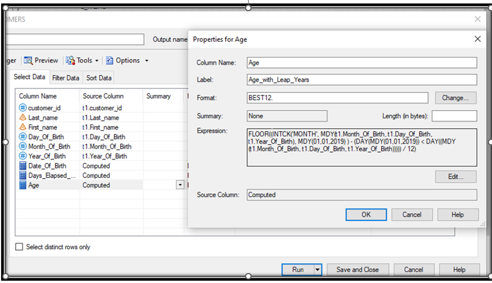
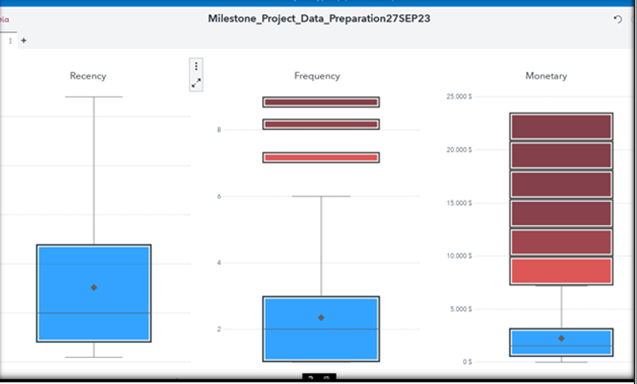

# Analyzing Real-World POS Data: Unveiling Consumer Behavior & Strategic Insights using SAS Software

The present work entails a comprehensive analysis of real sales data from XYZ Company located in Brazil, specializing in retail products related to hobbies like camping, golf, and more. This analysis employs exploratory methods alongside machine learning techniques, including RFM analysis (clustering), market basket analysis, and prediction using decision trees. Leveraging the capabilities of SAS Viya & SAS EG tools, this study extracts valuable insights from the data, uncovering patterns and trends critical for informed strategic decision-making.


[**Exploratory Analysis**](https://github.com/moraitis-alexandros/Analyzing-Real-World-POS-Data-Unveiling-Consumer-Behavior-and-Strategic-Insights-using-SAS-Software/blob/main/Exploratory-Analysis)

The Exploratory Data Analysis (EDA) encompassed a comprehensive investigation into sales dynamics, including detailed insights into sales levels across diverse product types. It delved into returns, calculating total monetary value and introducing the novel Loss Rate metric, shedding light on product inefficiencies impacting revenue. Analysis identified top-performing products per type, examined market share, mapped regional revenue distribution, and assessed supplier demand. Additionally, it explored variations in average basket size across weekdays, providing key insights into consumer behavior. The creation of new metrics like the Loss Rate enriched the analytical framework, empowering strategic decision-making for revenue optimization and operational enhancements at XYZ company.

[**RFM Analysis**](https://github.com/moraitis-alexandros/Analyzing-Real-World-POS-Data-Unveiling-Consumer-Behavior-and-Strategic-Insights-using-SAS-Software/blob/main/RFM-Analysis)

The enriched RFM analysis, segmented customers into four categories - Best (48.6%), First Timer (17.6%), Churner (28%), and Hibernating (19.7%). This segmentation, coupled with age-based clusters and new metrics like Weighted Churn Rate and Weighted Best Rate, pinpointed regions with high churners and concentrations of best customers. These insights paved the way for targeted strategies, emphasizing increasing the share of Best customers while addressing the challenge of high churn rates. Exploring potential correlations between churners and returns also provided actionable insights for product/service enhancements, contributing to XYZ company's refined targeting, retention, and satisfaction initiatives.

[**Market Basket Analysis**](https://github.com/moraitis-alexandros/Analyzing-Real-World-POS-Data-Unveiling-Consumer-Behavior-and-Strategic-Insights-using-SAS-Software/blob/main/Market-Basket-Analysis)

Identified pivotal products influencing sales, such as Hailstorm Steel Woods Set, Course Pro Umbrella, and Husky Rope 60, which collectively contributed to a substantial portion of total sales.

[**Decision Tree Analysis**](https://github.com/moraitis-alexandros/Analyzing-Real-World-POS-Data-Unveiling-Consumer-Behavior-and-Strategic-Insights-using-SAS-Software/blob/main/Decision-Tree-Analysis)

Predicted customer category 97 purchases to strategically allocate discount coupons, significantly enhancing buyer predictions by 2,9758 times compared to a basic model.

*The project was part of my final SAS Joint Certificate Report*

## References


# Exploratory Data Analysis Insights:

## Objective: 

The primary aim was to conduct an in-depth exploratory data analysis (EDA) to to uncover supplier demand, revenue trends, and factors driving consumer preferences. It encompassed customer demographics, regional insights, sales and return patterns, top products, promotional effectiveness, supplier analysis, and regional loss rates. Additionally, it delved into product origin preferences across different countries. Operational suggestions were proposed to optimize returns management, refine promotion strategies, enhance supplier relations, address regional challenges, and diversify product appeal.

## Tools Used

SAS EG

SAS Viya

## Dataset Overview:

- *Invoice*: 20,692 unique transactions (baskets)

- *Basket*: 312,537 entries connecting transactions (baskets) with products

- *Customers*: 8,584 unique customers

- *Products*: 144 unique items

Sales and returns are adjusted:

  - *Sales*: $17,458
    
  - *Returns*: $3,234
    
  - *Total*: 20,692 entries post-cleaning.

## Feature Engineering

*Data Cleaning:* In the process of data cleaning and age filtering, customer ages were calculated and subsequently filtered to ensure logical values. The data cleaning phase involved removing entries with birth years earlier than 1910 (considered overage) or later than 2001 (considered underage), contributing to a refined dataset.

*Generate Age Attribute:* Conversion of the birth date to a date format, the creation of a new variable counting the days passed since that date, and the calculation of age using functions, the birth date column is then removed to derive the rounded age. The code also takes into account leap years



*Age Range Transformation:* To enhance the analysis of age, it would be beneficial to categorize ages into specific age brackets (Very Young, Young, Middle Age, Mature, Old, Very Old). With this categorization, 
a more organized result emerges: Middle age customers represent 37.09%, followed by the Young group at 30.21%, while the Very Young group comprises 18.20%, showing a clearer breakdown of age segments.

*Top Product per Product Type & Market Share:* Developed a code snippet in SAS EG in order to examine top-selling products in each category, highlighting significant items, each occupying important share of their respective category's sales. Also highlight products that stand out with substantial market shares. Notably, while certain top products within some categories hold smaller shares, but collectively contribute significantly to overall sales, showcasing diversity despite individual product dominance. This analysis sheds light on both specific product performance and broader category trends in the market.

```sql
 %_eg_conditional_dropds(MILESTON.QUERY_TOP_prod_CATEG_PROD2);

PROC SQL;
   CREATE TABLE MILESTON.QUERY_TOP_PROD_CATEG AS 
   SELECT DISTINCT t1.'Product type'n,
   t1.SUM_of_COUNT_of_InvoiceNo as Category_Sales, 
PUT((t1.SUM_of_COUNT_of_InvoiceNo/300146),percent10.) as Category_Share,
t2.Product AS Top_Category_Product, 
   t1.MAX_of_COUNT_of_InvoiceNo as Product_Sales,
  PUT((t1.MAX_of_COUNT_of_InvoiceNo/t1.SUM_of_COUNT_of_InvoiceNo),percent10.) as Product_Category_Share 
      FROM    (SELECT t1.'Product type'n, 
          /* MAX_of_COUNT_of_InvoiceNo */
            (MAX(t1.Total_Invoices_include_Product)) AS MAX_of_COUNT_of_InvoiceNo, 
          /* SUM_of_COUNT_of_InvoiceNo */
            (SUM(t1.Total_Invoices_include_Product)) AS SUM_of_COUNT_of_InvoiceNo
      FROM MILESTON.QUERY_FOR_TOP_PRODUCTS_PER_TYPE t1
      GROUP BY t1.'Product type'n) as t1
           INNER JOIN MILESTON.QUERY_FOR_TOP_PRODUCTS_PER_TYPE t2 ON (t1.MAX_of_COUNT_of_InvoiceNo = 
          t2.Total_Invoices_include_Product AND t1.'Product type'n = t2.'Product type'n)
order by Product_Sales DESC;
QUIT;
```

*Maps Creation and integration with other Datasets:* Analyzed loss rates by connecting demographic density, observed significant loss rates in specific areas, and created vizualizations to depict these relationships.
Generated maps in Viya using longitude and latitude data, establishing a Geo-Hierarchy based on Country and Region levels for spatial analysis.

## In-depth Insights:

#### Sales & Returns Patterns:


📍 Total sales amount to $17,458 with returns standing at $3,234. Returns represent approximately 15.63% of overall transactions compared to 84.37% in sales.

📍 The monetary value of sales reaches $16,752,418.20, while returns sum up to $3,178,087.90, constituting about 15.95% of total transactions.

📍 Both return rates, in terms of quantity and monetary value, are concerning, urging further investigation into the reasons behind this trend.

📍 Average basket sizes for both sales and returns are close, indicating larger basket values for returns, potentially linked to delayed deliveries and high-value product returns. Investigating delivery delays' impact on high-value returns is crucial.

📍 Efforts should aim to increase sales basket metrics while simultaneously reducing return-related figures.

#### The Top Products & Categories Shares


📍 The analysis aims to identify top-selling products in various categories and their market shares.

📍 Significant products, such as Hailstorm Steel Woods Set, Course Pro Umbrella, and Hailstorm Steer Irons, each occupy around a quarter (25% - 26%) of sales in their respective categories.

📍 The Husky Rope 60 and Blue Steel Max Putter stand out, dominating their category with a substantial 34% market share.

📍 Notably, in categories like watches and eyewear, while top products hold smaller shares (8% and 6% respectively), these categories collectively contribute significantly to total sales (9% and 11% respectively).

📍 This analysis provides insights into both specific product performance and broader category trends within the market.

#### Promotion Analysis:


📍 Consumers tend to purchase products even when they aren't on sale, a trend worth consideration since, during the dataset's analysis period (as outlined in the appendix), all products were sold at some point on offer.

📍 Promotional efforts might not be targeting the right audience at the right time. That scenario indicates a problem with promotional campaigns not reaching the intended audience, resulting in wasted advertising expenses.

📍 Further customer analysis (using cluster & association rules) is crucial in both cases to ensure the right products are marketed to the right people at the appropriate times.

#### Supplier Analysis:


📍 Dragon SA leads in sales with 47,853 units, followed by Toktai & Chen at 43,543 units. However Toktai & Chen products are included in more invoices. This fact makes him the supplier with the highest demand.

📍 Carper n Sons, with an average of 13 unique codes, sells fewer products than Fabulo Ltd with 11 codes. This indicates lower consumer preference for Carper n Sons' products, prompting a need for quality checks and potential packaging improvements.

📍 Carper n Sons' products show lower demand despite higher value, necessitating further investigations into functionality, packaging, and price-quality relationships.

📍 Implementing electronic reviews to customers who purchased or returned Carper n Sons' products could offer deeper insights, especially if targeted towards better customer segments identified through RFM analysis for improved feedback and understanding of low demand reasons (price, product quality, or packaging).

#### Density Analysis:


📍 Regions AM and PI are quite sparsely populated, with Loss Rates of 32% and 28%, respectively, indicating that a significant portion of the income from these areas might not be actual income due to product returns.

📍 These areas' location, their sparse population, and potential delays in product delivery due to infrequent transportation could contribute to customer dissatisfaction and product returns.

📍 Additionally, densely populated regions like DF and SP also exhibit a high Loss Rate, possibly due to shipping delays caused by shipment volumes, resulting in returned products and additional expenses for the business if customers haven't received their orders.

📍 The company should focus on these regions to investigate issues further, such as collecting data on delivery times. Sending electronic surveys or contacting customers could help understand customer satisfaction levels and pinpoint problems related to product satisfaction, delivery times, or non-received items. The overall goal should be to reduce the Loss Rate in these regions.


#### Product Origin Analysis:


📍 Turkish Product Revenue: Lower total revenues indicate potential consumer disinterest or lower pricing. Unlike Chinese products, Turkish items lack consumer preference despite similar pricing.

📍 Indian Product Lead: Despite lower individual values compared to similar US-made items, Indian products attract consumers due to a better quantity-price balance, securing the top position in revenue.

📍 US Product Appeal: Despite higher unit values compared to counterparts, US products rank second in revenue, favored for their quality-price equilibrium.


### Operational Suggestions:

**Optimize Returns Management:** Develop strategies to reduce return rates by analyzing reasons behind returns, especially focusing on investigating delayed deliveries and high-value product returns to improve customer satisfaction.

**Refine Product Promotion Strategies:** Tailor promotional campaigns to target specific audiences effectively, ensuring that marketing efforts reach the right people at the right time, possibly through advanced customer segmentation techniques.

**Enhance Supplier Relations:** Collaborate with suppliers to improve product quality and packaging based on customer preferences, especially for suppliers with lower sales despite higher product values.

**Address Regional Challenges:** Focus on regions exhibiting high Loss Rates by investigating delivery delays, customer satisfaction, and product satisfaction issues, aiming to reduce returns and enhance operational efficiency.

**Diversify Product Appeal:** Explore opportunities to improve the appeal of products from regions like Turkey by understanding consumer preferences, pricing strategies, and potentially leveraging successful models from high-performing regions like India and the US.


# RFM Analysis Insight:

## Objective: 


At this stage, we proceeded with segmenting the customer base to enable profiling of the business's customers. This allows us to offer personalized services and products. Customer segmentation was conducted using RFM analysis based on three parameters:
• Recency - How recently did the customer make a purchase?
• Frequency - How often does the customer make purchases?
• Monetary - What is the total value of the customer's purchases?

## Tools Used

SAS EG to create RFM Table

SAS Visual Studio (in SAS Viya) to run Clustering pipeline

## Enhancing Data Integrity and Normalization for Effective Clustering

An analysis conducted using SAS EG and focuses on Distribution Analysis for RFM variables. It starts by examining the distribution of data to identify potential outliers. However, the hypothesis testing reveals that none of the variables follow a normal distribution, indicated by p-values <0.01 in the Kolmogorov-Smirnov test.


Observations from histograms and normal probability plots illustrate skewed distributions, especially for Recency and Monetary attributes with skewness >1. To address this, the analysis plans to remove outliers using boxplots and subsequently assess whether skewness changes. If not, a log transformation is proposed to reduce skewness and make the data closer to a normal distribution, aiming to mitigate the impact of large values on clustering.

```sql
/*calculate skewness and kurtosis for each numeric variable*/
proc means data=MILESTON.QUERY_CREATE_RFM_TABLE SKEWNESS KURTOSIS;
run;
```



The upper limits determined from SAS Viya RFM Boxplots guide the data filtering process, identifying specific maximum values for Recency, Frequency, and Monetary attributes. Post-filtering in SAS EG, the data set reduces to 7093 entries from an initial 7444, with subsequent Distribution Analysis indicating improvements in Recency and Frequency, notably reducing the skewness in Monetary.

Comparing skewness between filtered and unfiltered datasets highlights the effectiveness of filtering and presents a case for log transformation. The skewness decreases significantly post-filtering, emphasizing the necessity of incorporating a log transformation into the clustering pipeline for improved results.

## Creating a pipeline is SAS Visual Studio for Effective Clustering

The text discusses data filtering using metadata limits for "Frequency" and "Monetary" properties, alongside extreme percentiles for "Recency." The Recency property does not follow a normal distribution, as a result we cannot use standard deviations from the mean to handle outliers.

Additionally, a Log Transformation Method is applied in the pipeline due to the data's persistent skewness even after outlier limitation. Skewed data can negatively impact algorithms like k-means. Hence, a log transformation is performed, significantly reducing skewness.

For the Clustering Node Settings, the aim is to determine optimal features. The analysis requires at least four clusters based on RFM theory. The Aligned Box Criterion is used to select the number of clusters with the highest GAP statistic. Various normalization methods like z-score, range, and alignment methods such as Principal Component Analysis (PCA) were experimented with. PCA, despite reducing dimensionality, surprisingly improved the GAP statistic even in a few dimensions (three in this case) compared to no PCA.

## Optimizing Clustering Parameters for RFM Analysis

## Clustering Parameter Selection for RFM Analysis

| Choice | Standardization Method | Similarity Distance | PCA Enabled | GAP Results | Clusters |
|--------|------------------------|---------------------|-------------|-------------|----------|
| 1      | Z Score                | Euclidean           | Yes         | 0.63        | 4        |
| 2      | Z Score                | Euclidean           | No          | 0.33        | 3        |
| 3      | Z Score                | Manhattan           | Yes         | 0.87        | 2        |
| 4      | Z Score                | Manhattan           | No          | 0.63        | 2        |
| 5      | Range                  | Euclidean           | Yes         | 0.85        | 2        |
| 6      | Range                  | Euclidean           | No          | 0.39        | 5        |
| 7      | Range                  | Manhattan           | Yes         | 0.67        | 3        |
| 8      | Range                  | Manhattan           | No          | 0.48        | 3        |

### Summary
The optimal choice, meeting the criterion of at least four clusters for RFM analysis and displaying a higher GAP statistic, is Choice 1. This selection not only fulfills the minimum cluster criterion but also yields a higher GAP value compared to Choice 6 (GAP: 0.39).

### Chosen Parameters for Clustering
- **Standardization Method:** Z Score
- **Similarity Distance:** Euclidean
- **Alignment Method:** PCA

The resulting clustering will generate 4 clusters, observed with a GAP Statistic of 0.63. Subsequently, the Segment Profile node will assign each record its respective cluster, completing the pipeline with the Save Data node.

### Imputation Note
No imputation is required as there are no missing values in the dataset from the beginning.


## Customer Segmentation Analysis and Insights

| Cluster ID | Segment Description | Number of Customers | Percent % of Customers | Average Recency (weeks) | Average Frequency (purchase times) | Average Monetary (in $$$) |
|------------|---------------------|---------------------|-------------------------|--------------------------|------------------------------------|--------------------------|
| 1          | Worst - Hibernating | 1,394               | 20%                     | 25.37                    | 1                                  | 1,423.96                 |
| 2          | Churners            | 1,976               | 28%                     | 20.31                    | 2.60                               | 2,401.49                 |
| 3          | Best                | 2,477               | 35%                     | 3.97                     | 3.11                               | 2,631.84                 |
| 4          | First Timer         | 1,212               | 17%                     | 18.94                    | 1.39                               | 143.13                   |
| Totals     |                     | 7,059               | 100%                    | 15.34                    | 2.26                               | 1,901                    |

### Summary
This table presents the segmentation of customers across different clusters based on their behavior and purchasing patterns.

### Customer Cluster Insights

- **Worst - Hibernating:** 20% of customers in this cluster have an average recency of 25.37 weeks, making relatively infrequent purchases with lower monetary value.
  
- **Churners:** Representing 28% of customers, this segment shows a higher average frequency (2.60 purchase times) and monetary value (2,401.49 in $$$), but with a recency of 20.31 weeks.
  
- **Best:** Comprising 35% of customers, this cluster demonstrates the best behavior with a significantly lower recency (3.97 weeks) and higher frequency (3.11 purchase times), along with substantial monetary value (2,631.84 in $$$).
  
- **First Timer:** With 17% representation, customers in this cluster exhibit a higher recency (18.94 weeks) but lower frequency (1.39 purchase times) and monetary value (143.13 in $$$).

### Overall Insights

The total customer count is 7,059, with an average recency of 15.34 weeks, an average frequency of 2.26 purchase times, and an average monetary value of 1,901 in $$$.

## Customer Segmentation Analysis: Unveiling Behaviors and Strategies

This analysis delves into four distinct customer segments derived from purchase behavior, recency, frequency, and monetary value (RFM).


- **Best**: Represents top-tier customers who shop frequently, make recent purchases, and have a high monetary value, constituting the largest portion of customers (48.6%).
- 
- **First Timer**: Recent purchasers within a quarter but infrequent shoppers with a relatively low monetary value, forming the smallest customer percentage (17.6%).
- 
- **Churner**: Customers who previously made frequent purchases but haven't done so in about five months. Despite the hiatus, they had a high monetary value, accounting for 28% of customers.
- 
- **Hibernating**: Customers who haven't made purchases for 6-7 months, shop infrequently, yet possess a moderate monetary value close to the average ($1,423). They represent 19.7% of customers.

**Focus on Best & Churners Customers**: Incentivizing established customers with high frequency and value could lead to increased spending. They are more likely to respond positively to promotional campaigns aimed at enhancing their value. Also target Churners for Reactivation beecaus by re-engaging previous high-value customers who have been inactive could significantly boost revenues.

## Analyzing Regional Impact: Weighted Churn & Best Rate Metrics 

**Regions that most churners located (Weighted Churn Rate)**

It would be useful to analyze the areas where churn occurs the most. Once we identify the top regions, we can conduct a more targeted investigation into what causes the churn (e.g., competition, delivery times, etc.).
For this reason, it's not enough to simply measure the churners within an area, but rather the ratio of churners to the total customers in each area. The churn rate is calculated using the formula

```
 (churners_total/customer_total)*100
```
However, this specific formula shows a weakness as it doesn't consider the overall value that each city contributes to the company's turnover. More specifically, for economic reasons, the research will be carried out in specific cities (surveys, etc.) that present a high churn rate. However, it must be ensured that these cities have the ability to provide value to the company. Thus, a high churn rate alone is not sufficient (e.g., in Amapi, where it might be 40%, but the total customers are only 5). Therefore, we need to create a new measure called the weighted churn rate. As a result, I have identified the cities with the highest churn rates, taking into account the impact they have on the value. Therefore, I can focus on these cities to take action. 

**Regions that Best Customers are Located**
It would also be useful to analyze the areas where the best customers are located. Once we identify the top areas, we can conduct more targeted marketing. We follow a similar process and logic as before, but now focusing exclusively on the best customers and creating the metric Weighted Best Rate.

**Churners and Returns Correlation**
There is a significant issue with product returns, as they occupy a large percentage of total sales. Therefore, it would be useful to investigate whether customer churn is related to product returns. That is, what percentage of returns - Return_Rate - (i.e., how many invoices are marked as Return out of the total Sales) each cluster has?

The results from the above three metrics are shown in the vizualization below


- Given that the best customers are those with a higher likelihood of responsiveness, I will include areas with a Weighted Best Rate above 0.8% (as there is a significant difference beyond 0.8% compared to 0.5%). Here, the potential of the weighted average is evident as the RS area has a low best rate of 29% but ranks high in the weighted average. This happens because even though it has fewer best customers, they spend more than other cities with more best customers. Thus, the ranking with the weighted average, as mentioned, takes into account the monetary impact, which is something we want as we don't just want the best customers but also those who spend more. This ratio is achieved by the weighted average. Notice that the highest weighted best rate (out of one) is found in SP, RJ, MG, PR, RS, SC, BA, PE, DF, GO, CE (11 cities)). Similarly, if we add up the monetary values, we'll see that they have a value of 11,825,019.89$ -> 11,825,019.89$ /13,422,879.36$ = 88.1% of the total value. Therefore, in case of a limited budget, we can focus on these 11 cities instead of the total of 26 cities, which together account for only 12%.

- I also observe that the highest weighted churn rate (out of one) is found in SP, MG, RJ, RS, PR, BA. These cities are larger in Brazil. Similarly, if we add up the monetary values, we'll see that they have a value of 9,954,732.75$ -> 9,954,732.75$ /13,422,879.36$ = 74.2% of the total value. So, in case of a limited budget, we can focus on these 6 instead of the total of 26 cities, which collectively account for only 25%.

- I notice that for churners, there is a return rate of 14.34% (pertaining to the 11 cities mentioned earlier). This particular percentage is quite significant and requires investigation into whether the number of returns is related to customer churn. Therefore, with the same data, we are delving deeper to discover the categories of Returns.

## 6 Proposed Strategies for Improvement

- **Quality Assurance in 6 Regions:** Evaluation of delivery times, focusing on areas with a high weighted rate for product quality, order convenience, and competitive analysis.
  
- **Clear Return Policy:** Establishment of transparent return policies to ensure customer satisfaction.
  
- **Feedback Collection:** Gathering feedback through reviews and surveys from both best customers and churners.
  
- **Last Mile Optimization:** Collaboration with couriers to optimize last-mile delivery through enhanced tracking and reduced delivery times.


  
- **Targeted Advertising Campaigns:** Advertising campaigns targeted at regions with a high weighted best rate, utilizing recommendation systems for personalized outreach.
  
- **Enhanced E-shop Experience:** Optimizing the virtual store experience by incorporating augmented reality (e.g., sunglasses try-on) and improving product descriptions using multimedia such as photos and videos.


# Market Basket Analysis

This market analysis is based on data processed using SAS Viya for market basket analysis. The analysis combines price range (low, medium, high) and sales volume for each item to derive meaningful insights and opportunities.

| Cluster Category | Opportunity | Action | Justification |
|------------------|-------------|--------|---------------|
| All Clusters     | Stock Reduction | Adjust Star Gazer price higher & decrease Firefly; bundle in recommendation system | Boost Firefly sales at a lower price, clear excess stock |
| All Clusters     | Bundling | Bundle TrailChef Canteen with EverGlow Double; suggest as a combo in recommendation system | Boost sales for both; Canteen benefits from higher demand |
| Churners         | Campaign & Bundling | Ad campaign for Granite Shovel & BugShield Extreme; present as essential bundle for outdoor trips | Target outdoor enthusiasts, promote bundle for trips |
| Churners         | Ad Campaign & Offer | Campaign for Husky Harness Extreme & Hibernator Camp Cot; highlight for climbing trips | Target climbers, offer essentials with limited-time deals |
| Best             | Bundling & Promotion | Bundle EverGlow Butane & Star Dome; target best customers through ads; create low product clearance opportunity | Drive sales by bundling necessary camping items for the best customer segment |
| Best             | Price Adjustment & Offer | Slightly increase TrailChef Single Flame price & provide discount on Granite Carabiner; target loyalty cardholders | Encourage purchase through loyalty discounts and recommendations |


# Decision Tree Analysis

## Objective:

Conduct analysis on historical data, to create a model predicting current data using SAS Viya. The prediction concerns whether a customer will be a buyer in category 97 or not. Once this predictive model is built, targeted coupon campaigns can be sent to customers more likely to respond positively to category 97, thereby avoiding ad expenses on those less likely to respond.
  
## Process Overview:

### Check the proportion of buyers to non-buyers. Ideally, aiming for over 10%. If not, consider undersampling or oversampling.

Using a pie chart revealed that I have 30.2% buyers (631 buyers) and 69.8% non-buyers (2280 non-buyers) out of a total of 2,093 customers. This indicates that my data doesn't require undersampling or oversampling techniques.
    
### Check for null values. 

There are no null values
    
### Establish an operational cut-off point based on a profit matrix.

The profit matrix forms the basis for determining the minimum probability (minimum propability) a customer should be classified as a buyer before creating the decision tree (prediction model). This minimum probability, termed the operational cutoff point, is crucial to ensure profitable marketing campaigns.

- **Operational Cutoff Point Calculation:**
  - Consider P(Buyer) as the probability a customer is a buyer.
  - Calculate Total Expected Profit = Expected_Profit_PredictionGood – Expected_Profit_PredictionBad.
  - Define P(Buyer) > = 0.1666 as the cutoff point (minimum probability).
  
- **Interpretation of Cutoff Point:**
  - A value of 0.1666 represents the minimum probability a customer needs to be classified as a potential buyer in category 97, ensuring overall profit rather than loss.
  
- **Key Insight:**
  - The theoretical cutoff point (50%) is less efficient than the calculated 16.66%. Choosing the theoretical 50% loses potential buyers (P(Buyer) range: [0.166, 0.5]), impacting the expected profit positively.

### Construct a Decision Tree and extract conclusions.

### Decision Tree Explanation


Operational interpretation of the decision tree model results:

| Terminal Leaf | Explanation |
| --- | --- |
| Terminal Leaf 1 | If the customer's age is 41 or older and their total monetary value in the business is greater than or equal to $155, there is a 58.33% probability of purchasing category 97. |
| Terminal Leaf 2 | If the customer's age is 41 or older and their total monetary value in the business is less than $155 (missing information), there is a 95.16% probability that this customer will not purchase category 97. |
| Terminal Leaf 3 | If the customer's age is younger than 41 (or missing) and their total monetary value in the business is greater than $136.80, there is a 92.77% probability that this customer will purchase category 97. |
| Terminal Leaf 4 | If the customer's age is younger than 41 (or missing), their total monetary value in the business is less than $136.80 (or missing), and their most recent purchase was at least 7 weeks ago (inclusive), there is a 76.32% probability that this customer will not purchase category 97. |
| Terminal Leaf 5 | If the customer's age is younger than 41 (or missing), their total monetary value in the business is less than $136.80 (or missing), and their most recent purchase was less than 7 weeks ago (excluding 7), there is a 76.92% probability that this customer will purchase category 97. |

Additional Note: Considering the operational cut-off point (0.166), the model categorizes customers with a probability greater than 16.66% as buyers (or conversely, those with a probability less than 83.34% as non-buyers). Terminal Leafs 1, 3, 4, 5 classify customers as buyers, while Terminal Leaf 2 categorizes them as non-buyers.

The significant variables distinguishing between categories are age, total monetary value, and recency. These factors help comprehend a customer's behavior concerning the purchase of category 97. Age reflects consumer preferences, indicating potential attraction towards category 97 for a younger audience. Total monetary value reflects economic capacity, while recency mirrors customer dedication to the business. Leveraging this information, strategies can be adapted to target customers meeting specific criteria, increasing profits from potential purchases, while mitigating losses from wrongly targeted customers.

**xi. Cumulative Response Graph**

The Response Rate generally emerges as follows: If I take all the clients from the validation set and arrange their probabilities in descending order, the response rate is determined by the formula:

\[ \text{Response rate} = \frac{\text{TP}}{\text{Total number of predicted positive}} = \frac{\text{TP}}{\text{TP + FP}} \]

The y-axis shows the cumulative response rate, while the x-axis represents the percentages of the best (sorted in descending order) potential clients (those the model predicts as buyers).

Given the analysis based on the graph values and the operational translation of the result, I have:

For the 15% (required according to the specification and considering a range up to 20%):

In the optimal decision tree: cumulative response rate = 87.879%
If I take the top 15% of clients (sorted with the highest probability of being buyers according to the optimal decision tree model), 87.879% of this 15% will be buyers (they will buy category 97).

**xi. Cumulative Response Graph**

The Response Rate generally emerges as follows: If I take all the clients from the validation set and arrange their probabilities in descending order, the response rate is determined by the formula:

\[ \text{Response rate} = \frac{\text{TP}}{\text{Total number of predicted positive}} = \frac{\text{TP}}{\text{TP + FP}} \]

The y-axis shows the cumulative response rate, while the x-axis represents the percentages of the best (sorted in descending order) potential clients (those the model predicts as buyers).

Given the analysis based on the graph values and the operational translation of the result, I have:

For the 15% (required according to the specification and considering a range up to 20%):

In the optimal decision tree: cumulative response rate = 87.879%
If I take the top 15% of clients (sorted with the highest probability of being buyers according to the optimal decision tree model), 87.879% of this 15% will be buyers (they will buy category 97).

**Response Graph**

Building on the preceding analysis of the % cumulative response graph, we can proceed to analyze the % response graph. These details still pertain to the validation set. The data is again sorted in descending order of probability (to be a buyer=1). However, I am not operating cumulatively here; instead, I segment the sorted clients into buckets with a 5% buyer rate (20 quantiles/buckets in total) in each (x-axis).

Taking all this into account, I interpret the result as follows:

For the 15% (as requested and within the range of 15%-20%):

In the optimal decision tree, the response rate is 87.879%.
If I take the 4th bucket (15%-20%) of the top clients (sorted with a higher probability of being buyers according to the optimal decision tree model), 87.879% of clients in this bucket will be buyers (purchasing category 97).

**Cumulative Lift Chart**

The % cumulative lift chart is generated by dividing the values derived from the cumulative response chart by the percentage of the naive model (if, for instance, no model were used for prediction). The x-axis is divided into 20 quantiles of 5% of the data (in descending order of probability).

From the above, we observe:

- If the cumulative lift value is greater than 1, it's better to use our model for prediction than no model (random selection).
- The cumulative lift measures how much more likely it is to observe P(Buyer)=1 in a specific percentage (quantile) using our model compared to random selection.

Considering all the above, I interpret the result as follows:

For the 20% (as requested):

In the optimal decision tree, the cumulative lift = 2.9758%.
If I take the top 15% of clients (sorted with a higher probability of being buyers according to the optimal decision tree model), there will be 2.9758 times more buyers found among these clients than if I followed the same process without a model (naïve model-random).

**Cumulative % Captured Response Graph**

The cumulative % captured response graph pertains to the validation set. The data is still sorted in descending order of probability (to be a buyer=1) and is cumulative. Essentially, the graph presents the percentage of sorted claims in the validation set (x-axis), representing the percentage of clients the model correctly identifies as buyers compared to the total clients identified as buyers in the validation set (always referring to the respective cumulative percentage).

More specifically, considering all the above, I can express the cumulative % captured response rate as follows:

For the 25% (as required):

In the optimal decision tree, the cumulative % captured response rate = 59.516%.
If I take the top 20% of clients (sorted with a higher probability of being buyers according to the optimal decision tree model), 59.516% of the clients identified as buyers will be found among the entire validation dataset.

**Apply the Scoring and Model Evaluation**

Uploading the newcustomers table and running a profiling through the manage data feature yielded the following results:

I noticed there are no null values, so I proceeded to create the node score_Data. Utilizing the results obtained, I used the explore and visualize tool, resulting in the following bar chart:

The model predicted that out of 200 clients (pertaining to the new customers file), 155 will be buyers (78% buyers). Conversely, 45 will be Non-Buyers (22% Non-Buyers).

Subsequently, I created a bar chart with the Probability_for_class_97=1 variable (categorized):

Observing the dataset, the minimum probability found is 4.83%, and the maximum is 92.77%. However, these values refer to the entire dataset (buyers & non-buyers). If I create a filter only for the buyers (Predicted_for_class97 = 1), accounting for the operational cutoff point


