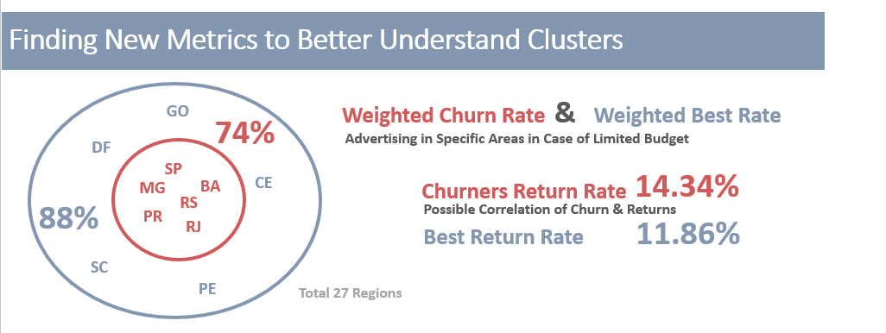

# RFM Analysis Insight:

## Objective: 


At this stage, we proceeded with segmenting the customer base to enable profiling of the business's customers. This allows us to offer personalized services and products. Customer segmentation was conducted using RFM analysis based on three parameters:
• Recency - How recently did the customer make a purchase?
• Frequency - How often does the customer make purchases?
• Monetary - What is the total value of the customer's purchases?

## Tools Used

SAS EG to create RFM Table

SAS Visual Studio (in SAS Viya) to run Clustering pipeline

## Enhancing Data Integrity and Normalization for Effective Clustering

An analysis conducted using SAS EG and focuses on Distribution Analysis for RFM variables. It starts by examining the distribution of data to identify potential outliers. However, the hypothesis testing reveals that none of the variables follow a normal distribution, indicated by p-values <0.01 in the Kolmogorov-Smirnov test.


Observations from histograms and normal probability plots illustrate skewed distributions, especially for Recency and Monetary attributes with skewness >1. To address this, the analysis plans to remove outliers using boxplots and subsequently assess whether skewness changes. If not, a log transformation is proposed to reduce skewness and make the data closer to a normal distribution, aiming to mitigate the impact of large values on clustering.

```sql
/*calculate skewness and kurtosis for each numeric variable*/
proc means data=MILESTON.QUERY_CREATE_RFM_TABLE SKEWNESS KURTOSIS;
run;
```


The upper limits determined from SAS Viya RFM Boxplots guide the data filtering process, identifying specific maximum values for Recency, Frequency, and Monetary attributes. Post-filtering in SAS EG, the data set reduces to 7093 entries from an initial 7444, with subsequent Distribution Analysis indicating improvements in Recency and Frequency, notably reducing the skewness in Monetary.

Comparing skewness between filtered and unfiltered datasets highlights the effectiveness of filtering and presents a case for log transformation. The skewness decreases significantly post-filtering, emphasizing the necessity of incorporating a log transformation into the clustering pipeline for improved results.

## Creating a pipeline is SAS Visual Studio for Effective Clustering

The clustering process is modeled through the pipeline below using SAS Visual Studio


The text discusses data filtering using metadata limits for "Frequency" and "Monetary" properties, alongside extreme percentiles for "Recency." The Recency property does not follow a normal distribution, as a result we cannot use standard deviations from the mean to handle outliers.

Additionally, a Log Transformation Method is applied in the pipeline due to the data's persistent skewness even after outlier limitation. Skewed data can negatively impact algorithms like k-means. Hence, a log transformation is performed, significantly reducing skewness.

For the Clustering Node Settings, the aim is to determine optimal features. The analysis requires at least four clusters based on RFM theory. The Aligned Box Criterion is used to select the number of clusters with the highest GAP statistic. Various normalization methods like z-score, range, and alignment methods such as Principal Component Analysis (PCA) were experimented with. PCA, despite reducing dimensionality, surprisingly improved the GAP statistic even in a few dimensions (three in this case) compared to no PCA.


## Clustering Parameter Selection for RFM Analysis

| Choice | Standardization Method | Similarity Distance | PCA Enabled | GAP Results | Clusters |
|--------|------------------------|---------------------|-------------|-------------|----------|
| 1      | Z Score                | Euclidean           | Yes         | 0.63        | 4        |
| 2      | Z Score                | Euclidean           | No          | 0.33        | 3        |
| 3      | Z Score                | Manhattan           | Yes         | 0.87        | 2        |
| 4      | Z Score                | Manhattan           | No          | 0.63        | 2        |
| 5      | Range                  | Euclidean           | Yes         | 0.85        | 2        |
| 6      | Range                  | Euclidean           | No          | 0.39        | 5        |
| 7      | Range                  | Manhattan           | Yes         | 0.67        | 3        |
| 8      | Range                  | Manhattan           | No          | 0.48        | 3        |

The optimal choice, meeting the criterion of at least four clusters for RFM analysis and displaying a higher GAP statistic, is Choice 1. This selection not only fulfills the minimum cluster criterion but also yields a higher GAP value compared to Choice 6 (GAP: 0.39).

### Chosen Parameters for Clustering
- **Standardization Method:** Z Score
- **Similarity Distance:** Euclidean
- **Alignment Method:** PCA

The resulting clustering will generate 4 clusters, observed with a GAP Statistic of 0.63. Subsequently, the Segment Profile node will assign each record its respective cluster, completing the pipeline with the Save Data node.

### Imputation Note
No imputation is required as there are no missing values in the dataset from the beginning.


## Customer Segmentation Analysis and Insights

| Cluster ID | Segment Description | Number of Customers | Percent % of Customers | Average Recency (weeks) | Average Frequency (purchase times) | Average Monetary (in $$$) |
|------------|---------------------|---------------------|-------------------------|--------------------------|------------------------------------|--------------------------|
| 1          | Worst - Hibernating | 1,394               | 20%                     | 25.37                    | 1                                  | 1,423.96                 |
| 2          | Churners            | 1,976               | 28%                     | 20.31                    | 2.60                               | 2,401.49                 |
| 3          | Best                | 2,477               | 35%                     | 3.97                     | 3.11                               | 2,631.84                 |
| 4          | First Timer         | 1,212               | 17%                     | 18.94                    | 1.39                               | 143.13                   |
| Totals     |                     | 7,059               | 100%                    | 15.34                    | 2.26                               | 1,901                    |

### Summary
This table presents the segmentation of customers across different clusters based on their behavior and purchasing patterns.

### Customer Cluster Insights

- **Worst - Hibernating:** 20% of customers in this cluster have an average recency of 25.37 weeks, making relatively infrequent purchases with lower monetary value.
  
- **Churners:** Representing 28% of customers, this segment shows a higher average frequency (2.60 purchase times) and monetary value (2,401.49 in $$$), but with a recency of 20.31 weeks.
  
- **Best:** Comprising 35% of customers, this cluster demonstrates the best behavior with a significantly lower recency (3.97 weeks) and higher frequency (3.11 purchase times), along with substantial monetary value (2,631.84 in $$$).
  
- **First Timer:** With 17% representation, customers in this cluster exhibit a higher recency (18.94 weeks) but lower frequency (1.39 purchase times) and monetary value (143.13 in $$$).

### Overall Insights

The total customer count is 7,059, with an average recency of 15.34 weeks, an average frequency of 2.26 purchase times, and an average monetary value of 1,901 in $$$.

## Customer Segmentation Analysis: Unveiling Behaviors and Strategies

This analysis delves into four distinct customer segments derived from purchase behavior, recency, frequency, and monetary value (RFM).


- **Best**: Represents top-tier customers who shop frequently, make recent purchases, and have a high monetary value, constituting the largest portion of customers (48.6%).
- 
- **First Timer**: Recent purchasers within a quarter but infrequent shoppers with a relatively low monetary value, forming the smallest customer percentage (17.6%).
- 
- **Churner**: Customers who previously made frequent purchases but haven't done so in about five months. Despite the hiatus, they had a high monetary value, accounting for 28% of customers.
- 
- **Hibernating**: Customers who haven't made purchases for 6-7 months, shop infrequently, yet possess a moderate monetary value close to the average ($1,423). They represent 19.7% of customers.

**Focus on Best & Churners Customers**: Incentivizing established customers with high frequency and value could lead to increased spending. They are more likely to respond positively to promotional campaigns aimed at enhancing their value. Also target Churners for Reactivation beecaus by re-engaging previous high-value customers who have been inactive could significantly boost revenues.

## Analyzing Regional Impact: Weighted Churn & Best Rate Metrics 

**Regions that most churners located (Weighted Churn Rate)**

It would be useful to analyze the areas where churn occurs the most. Once we identify the top regions, we can conduct a more targeted investigation into what causes the churn (e.g., competition, delivery times, etc.).
For this reason, it's not enough to simply measure the churners within an area, but rather the ratio of churners to the total customers in each area. The churn rate is calculated using the formula

```
 (churners_total/customer_total)*100
```
However, this specific formula shows a weakness as it doesn't consider the overall value that each city contributes to the company's turnover. More specifically, for economic reasons, the research will be carried out in specific cities (surveys, etc.) that present a high churn rate. However, it must be ensured that these cities have the ability to provide value to the company. Thus, a high churn rate alone is not sufficient (e.g., in Amapi, where it might be 40%, but the total customers are only 5). Therefore, we need to create a new measure called the weighted churn rate. As a result, I have identified the cities with the highest churn rates, taking into account the impact they have on the value. Therefore, I can focus on these cities to take action. 

**Regions that Best Customers are Located**
It would also be useful to analyze the areas where the best customers are located. Once we identify the top areas, we can conduct more targeted marketing. We follow a similar process and logic as before, but now focusing exclusively on the best customers and creating the metric Weighted Best Rate.

**Churners and Returns Correlation**
There is a significant issue with product returns, as they occupy a large percentage of total sales. Therefore, it would be useful to investigate whether customer churn is related to product returns. That is, what percentage of returns - Return_Rate - (i.e., how many invoices are marked as Return out of the total Sales) each cluster has?

The results from the above three metrics are shown in the vizualization below



- Given that the best customers are those with a higher likelihood of responsiveness, I will include areas with a Weighted Best Rate above 0.8% (as there is a significant difference beyond 0.8% compared to 0.5%). Here, the potential of the weighted average is evident as the RS area has a low best rate of 29% but ranks high in the weighted average. This happens because even though it has fewer best customers, they spend more than other cities with more best customers. Thus, the ranking with the weighted average, as mentioned, takes into account the monetary impact, which is something we want as we don't just want the best customers but also those who spend more. This ratio is achieved by the weighted average. Notice that the highest weighted best rate (out of one) is found in SP, RJ, MG, PR, RS, SC, BA, PE, DF, GO, CE (11 cities)). Similarly, if we add up the monetary values, we'll see that they have a value of 11,825,019.89$ -> 11,825,019.89$ /13,422,879.36$ = 88.1% of the total value. Therefore, in case of a limited budget, we can focus on these 11 cities instead of the total of 26 cities, which together account for only 12%.

- I also observe that the highest weighted churn rate (out of one) is found in SP, MG, RJ, RS, PR, BA. These cities are larger in Brazil. Similarly, if we add up the monetary values, we'll see that they have a value of 9,954,732.75$ -> 9,954,732.75$ /13,422,879.36$ = 74.2% of the total value. So, in case of a limited budget, we can focus on these 6 instead of the total of 26 cities, which collectively account for only 25%.

- I notice that for churners, there is a return rate of 14.34% (pertaining to the 11 cities mentioned earlier). This particular percentage is quite significant and requires investigation into whether the number of returns is related to customer churn. Therefore, with the same data, we are delving deeper to discover the categories of Returns.

## 6 Proposed Strategies for Improvement

- **📍 Quality Assurance in 6 Regions:** Evaluation of delivery times, focusing on areas with a high weighted rate for product quality, order convenience, and competitive analysis.
  
- **📍 Clear Return Policy:** Establishment of transparent return policies to ensure customer satisfaction.
  
- **📍 Feedback Collection:** Gathering feedback through reviews and surveys from both best customers and churners.
  
- **📍 Last Mile Optimization:** Collaboration with couriers to optimize last-mile delivery through enhanced tracking and reduced delivery times.

- **📍 Targeted Advertising Campaigns:** Advertising campaigns targeted at regions with a high weighted best rate, utilizing recommendation systems for personalized outreach.
  
- **📍 Enhanced E-shop Experience:** Optimizing the virtual store experience by incorporating augmented reality (e.g., sunglasses try-on) and improving product descriptions using multimedia such as photos and videos.

